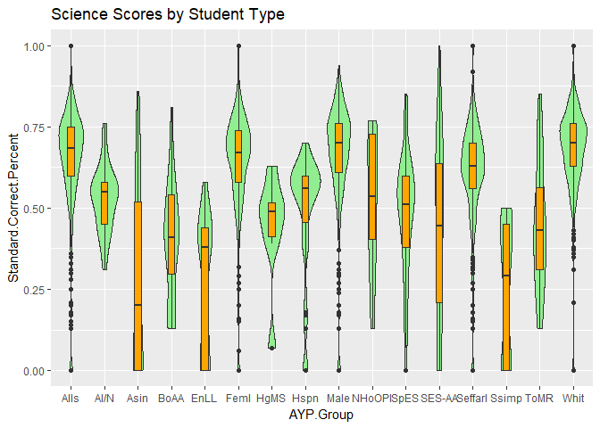

Team Bazinga: R Plot Data Analysis
================

Set 1 Data Plot 1: All Scores by Subject
----------------------------------------

This plot represents the entire Set 1 data. As you will notice the grading scale for each subject is not identical, so we need to evaluate the subjects separetly by splitting the data. The graph depicts a Boxplot overlayied a Violin plot. Nothing can be determined by this graph, this will just be an inital level set of the data we are working with.

Set 1 Data Plot 2: Math scores by Student Demographic
-----------------------------------------------------

After we split the data by Subject, the first Subject to be evaluated is Mathematics. This graph displays the Boxplot and Violin graph for all the Student demographics, which include the following Student Types.

-   All students
-   American Indian/Alaska Native
-   Asian
-   Black or African American
-   English Language Learners
-   Female
-   Highly Mobile Students
-   Hispanic
-   Male
-   Native Hawaiian or Other Pacific Islander
-   Special Education Students
-   Special Education Students - Alternate Assessment
-   Students eligible for free and reduced lunch
-   Students served in migrant programs
-   Two or More Races
-   White

The labels on the graph have been abbrevated to fit, and are a bit difficult to read, but the graph is in alphabetical order as the list is above.

The Box Plot has been overlayed with a violin graph to check for any Bimodal situations that would cause us to believe the data is not normalaized. The graph seems to show that the data for each student type appears to be normal.

The results of the Boxplot appears to show the highest scoring demographic in the subject area of Mathmatics is Asian students, followed by White, followed by Males, followed by Females.

Set 1 Data Plot 3: Reading scores by Student Demographic
--------------------------------------------------------

After we split the data by Subject, the second Subject to be evaluated is Reading. This graph displays the Boxplot and Violin graph for all the Student demographics, which include the following Student Types.

-   All students
-   American Indian/Alaska Native
-   Asian
-   Black or African American
-   English Language Learners
-   Female
-   Highly Mobile Students
-   Hispanic
-   Male
-   Native Hawaiian or Other Pacific Islander
-   Special Education Students
-   Special Education Students - Alternate Assessment
-   Students eligible for free and reduced lunch
-   Students served in migrant programs
-   Two or More Races
-   White

The lables on the graph have been abbrevated to fit, and are a bit difficult to read, but the graph is in alphabetical order as the list is above.

The Box Plot has been overlayed with a violin graph to check for any Bimodal situations that would cause us to believe the data is not normalaized. The graph seems to show that the data for each student type appears to be normal, with the exception of Highly Mobile Students and Native Hawaiian. Towards the bottom there does appear to be a surge of increasing values that would cause the data to be a bit skewed.

The results of the Boxplot appears to show the highest scoring demographic in the subject area of Reading is White students, followed by Female, followed by Asian, followed by Two or More Races. Males came in 5th.

Set 1 Data Plot 4: Science scores by Student Demographic
--------------------------------------------------------

After we split the data by Subject, the third Subject to be evaluated is Science. This graph displays the Boxplot and Violin graph for all the Student demographics, which include the following Student Types.

-   All students
-   American Indian/Alaska Native
-   Asian
-   Black or African American
-   English Language Learners
-   Female
-   Highly Mobile Students
-   Hispanic
-   Male
-   Native Hawaiian or Other Pacific Islander
-   Special Education Students
-   Special Education Students - Alternate Assessment
-   Students eligible for free and reduced lunch
-   Students served in migrant programs
-   Two or More Races
-   White

The lables on the graph have been abbrevated to fit, and are a bit difficult to read, but the graph is in alphabetical order as the list is above.

The Box Plot has been overlayed with a violin graph to check for any Bimodal situations that would cause us to believe the data is not normalaized. The graph seems to show that the data for each student type appears to be normal, except for Highly Mobile Students and Hispanic students. There seems to be a surge of increases values clustering towards the bottom, which could weight down the Average.

The results of the Boxplot appears to show the highest scoring demographic in the subject area of Science is White students and or Male students (there seems to be a tie), followed by Female, followed by Students eligible for a free and reduced lunch, followed by Hispanic. There also appears to be a significant reduction in the scores for Asian, English Language Learners, and Students served in migrant programs. The first quartile appears to be pulled to the bottom of the graph.

Set 1 Data Plot 5: Writing scores by Student Demographic
--------------------------------------------------------

After we split the data by Subject, the fourth Subject to be evaluated is Writing. This graph displays the Boxplot and Violin graph for all the Student demographics, which include the following Student Types.

-   All students
-   American Indian/Alaska Native
-   Asian
-   Black or African American
-   English Language Learners
-   Female
-   Highly Mobile Students
-   Hispanic
-   Male
-   Native Hawaiian or Other Pacific Islander
-   Special Education Students
-   Special Education Students - Alternate Assessment
-   Students eligible for free and reduced lunch
-   Students served in migrant programs
-   Two or More Races
-   White

The lables on the graph have been abbrevated to fit, and are a bit difficult to read, but the graph is in alphabetical order as the list is above.

The Box Plot has been overlayed with a violin graph to check for any Bimodal situations that would cause us to believe the data is not normalaized. The graph seems to show that the data for each student type appears to be normal.

The results of the Boxplot appears to show the highest scoring demographic in the subject area of Writing is Asian students, followed by Females, followed by White, followed by Two or More Races.

### Research Question: Does the percentage of teachers with masters degree has an impact on Students Dropout Rate.

#### [Link to RScripts used to create plots for Dataset 2&3](https://github.com/ArchanaRaghu512/NebraskaEducationSystem/blob/master/Rplot/Set%202%20%26%203.Rmd)

#### Dataset-2 Plot 1: Percentage of teachers witih Masters Degree VS Dropout Rate.
  From the discussion board one curious question which everyone wanted to know, was does the teachers with masters degree has an impact on students dropout rate.  This basic plot gives us a interpretation that there wasn't much impact beacuse of teachers who had masters degree.  But there was a little decreasing scattered variation in the dropout rate.
  
  
  
 ### Percentage of teachers witih Masters Degree VS Dropout rate - Year.
   The above graph gives us the description on the varying dropout Rate. And to give a representation of the year wise distribution had used ggplot and divided the data based on the year. IS shows that just for year 2014 the had a increased dropout rate compared to rest. This shows that the teachers with masters degree was not directly proportional to the dropout rate.
  
  
  
 #### Dataset-3 Plot 1: Attendance rate VS Dropout rate.
  To figure out if the attendance rate of students was related to the dropout rate. Plotted a ggplot which indicates that for increasing attendance rate the dropout rate was decreasing. This shows that the students attendance rate was a reason for the dropout rate.

Set 4 Data Plot 1: Graduation Percentage Based on Category Others
-----------------------------------------------------------------

This plot represents the graduation percentage and count based the Other categories.

From the graph we can come to a conclusion that the "Students eligible for free and reduced lunch" have the highest graduation percentage and count.

Set 4 Data Plot 2: Graduation Percentage Based on Category Ethnicity
--------------------------------------------------------------------

This plot represents the graduation percentage and count based the Other categories.

From the graph we can come to a conclusion that the "Ethnic : Whites" have the highest graduation percentage and count.

Set 4 Data Plot 3: Graduation Percentage Based on Category Gender
-----------------------------------------------------------------

This plot represents the graduation percentage and count based on Gender.

From the graph we can come to a conclusion that the "Male" and "Females" are almost but the males have a slightly high graduation percentage and count.

Set 5 Data Plot 1: Dropout Rate Vs ELL Percentage
-------------------------------------------------

This plot represents how the Dropout rate is affected by ELL Percentage

From the graph we can come to a conclusion that the "Dropout Rate" of a school is high where the percentage of ELL is less and 
the Dropout Rate of the school is low where the ELL percentage is high. 

[Link to RScripts used to create plots](https://github.com/ArchanaRaghu512/NebraskaEducationSystem/blob/master/Rplot/Set%202%20%26%203.Rmd)
